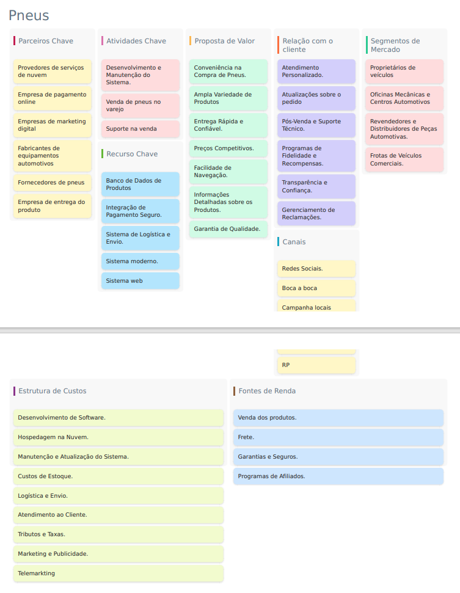

# 2. Descrição do Projeto

## 2.1 Visão Geral do Projeto

Diante da crescente demanda por uma experiência de compra online acessível,
segura e conveniente no mercado de pneus e produtos automotivos, surge o projeto para a
criação de uma loja online inovadora e diferenciada. Nosso objetivo é oferecer uma
plataforma intuitiva e agradável, que permita aos clientes navegar com facilidade, encontrar
os produtos desejados e efetuar suas compras de forma rápida e segura, tudo isso no
conforto de suas casas.
A essência do nosso projeto está em proporcionar uma experiência de compra
excepcional aos nossos clientes, garantindo produtos de alta qualidade e um atendimento
ao cliente dedicado sempre que necessário. Nossa visão vai além de simplesmente vender
produtos: buscamos construir relacionamentos duradouros com nossos clientes,
entendendo suas necessidades e oferecendo soluções personalizadas.
Em resumo, nosso projeto é mais do que uma simples loja online: é uma plataforma
que visa transformar a maneira como as pessoas compram pneus e produtos automotivos,
oferecendo conveniência, segurança e qualidade incomparáveis. Estamos ansiosos para
embarcar nessa jornada e fazer parte da vida de nossos clientes, fornecendo soluções que
realmente fazem a diferença.

### 2.1.1 Canvas do Projeto

## 2.2 Stakeholders

- Gustavo - Desenvolvedor do Software
- Kaua- Analistas de Sistemas
- Kaue- Designers de Interface de Usuário
- Paulo- Gerente de Projeto
- Funcionários da Loja - Manter os produtos e prestar suporte aos clientes se necessário
- Fornecedor de pneus e produtos- fornecer os produtos que serão vendidos -ClientesComprar os produtos
- Empresas de marketing- impulsionar o crescimento da empresa
- Empresa de entrega- Efetuar as entregas dos produtos
- Empresa de pagamento online- Gerenciar a parte de pagamento
- Provedores de serviços de nuvem- Disponibilizar o servidor para o sistema e armazenar
os dados

## 2.3 Objetivos

1.Aumentar as Vendas Online:
- Aumentar as vendas mensais da loja online.
- Acompanhar o volume de vendas mensais através de relatórios de vendas gerados
pelo sistema.
- Implementar estratégias de marketing digital e oferecer uma experiência de compra
aprimorada para atrair mais clientes e incentivar compras repetidas.
2.Melhorar a Experiência do Cliente:
- Aumentar a taxa de satisfação do cliente
- Implementar uma interface de usuário intuitiva, melhorar o processo de compra e
fornecer um serviço de atendimento ao cliente eficiente.
3. Expandir a Base de Clientes:
- Aumentar o número de clientes cadastrados na loja online
- Acompanhar o número de novos registros de clientes através do sistema.
4. Estabelecer Parcerias Estratégicas:
- Estabelecer parcerias com pelo menos 10 mecânicas e órgãos públicos 
- Acompanhar o número de parcerias estabelecidas e monitorar o desempenho
dessas parcerias através do sistema.
