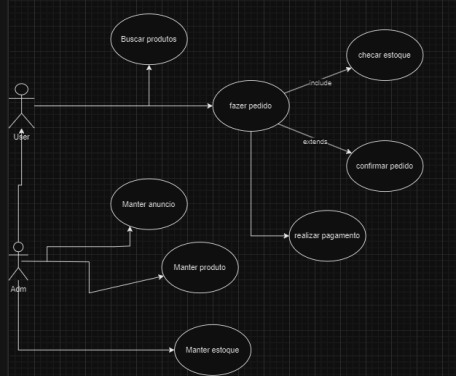

# 4. Diagrama de Caso de Uso

## 4.1 Descrição de Caso de Uso

1. Mater carrinho de compras:
Ator Principal: User
Descrição:
- O cliente acessa o sistema de loja online e navega pelas categorias de pneus
disponíveis.
- Ele seleciona o tamanho e modelo desejado de pneu, utilizando filtros de busca para
refinar sua pesquisa.
- Após encontrar o produto desejado, o cliente adiciona o pneu ao carrinho de compras.
- Ele revisa o carrinho para verificar os itens selecionados, quantidade e preço total.
- Em seguida, o cliente prossegue para o checkout, onde fornece informações de
entrega e pagamento.
- Após confirmar o pedido, o sistema processa o pagamento de forma segura.
- Por fim, o cliente recebe os pneus no endereço especificado e pode acompanhar o
status da entrega através do sistema.
Manter Produto:
Ator Principal:Adm
Descrição:
- O administrador acessa o sistema de administração e navega até a seção de gestão
de produtos.
- Ele visualiza a lista de produtos cadastrados no sistema, incluindo informações como
nome, descrição, preço, estoque disponível e status de disponibilidade.
- O administrador pode adicionar novos produtos ao sistema, fornecendo detalhes como
nome, descrição, categoria, preço, quantidade em estoque e imagens do produto.
- Ele também pode editar ou excluir informações de produtos existentes, incluindo a
possibilidade de atualizar o preço, a descrição, as imagens e o estoque disponível.
- Além disso, o administrador pode definir o status de disponibilidade de um produto,
marcando-o como disponível para compra ou temporariamente indisponível. .